# game

Simulation of Conway's Game of Life

## How To Compile

ONLY TESTED SUCCESSFULLY ON `Ubuntu`!

1. Install SDL2

```bash
$ sudo apt-get install libsdl2-dev libsdl2-ttf-dev
```

2. Build and run

```bash
$ mkdir build
$ cd build
$ cmake ..
$ make
$ ./game_of_life
```

To ease compilation, I provided my compiled binary `binary/game_of_life` in this repo. You should execute it under the `binary` directory, otherwise it will fail to load the font file.

## How To USe

1. The initial user interface is:
   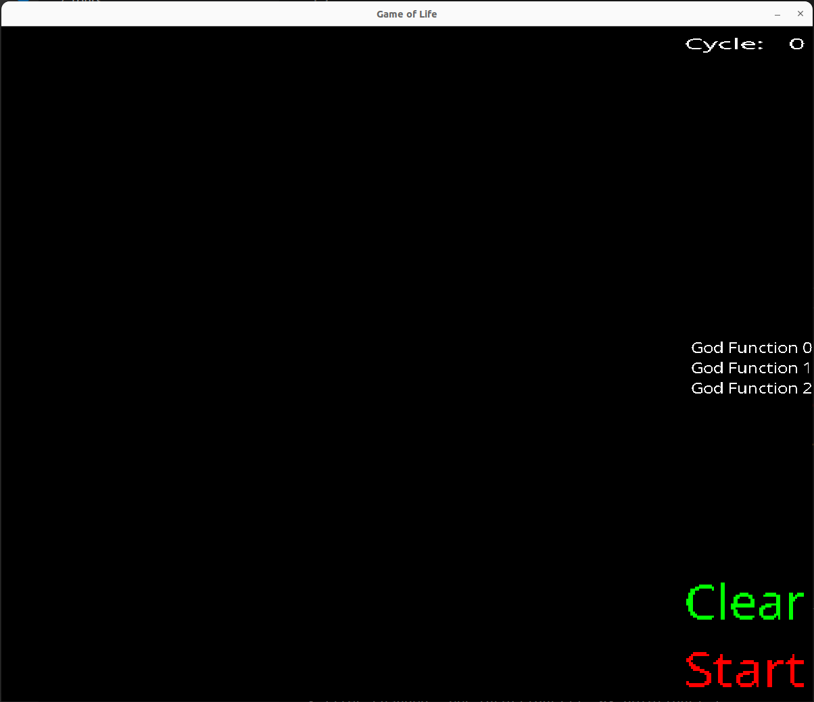
   The black represents that the cell is dead, and the white represents that the cell is alive.
2. Click `God Function 0`, `God Function 1`, `God Function 2` respectively to seed/terminate life on the board. Here I click the `god_function1`:
   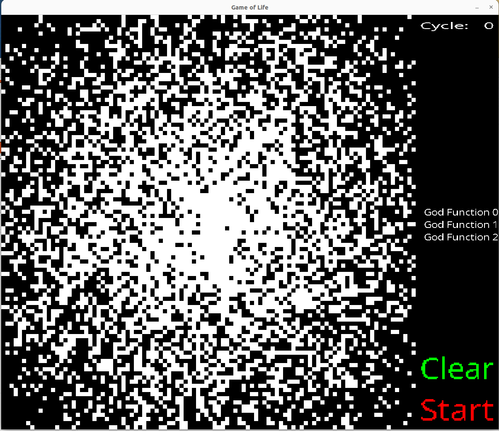
   `god_function2` seeds life in a normal distribution, i.e. the center of the board is more likely to be alive than the edges
3. Then you can click `Start` to run the simulation. You can observe the envolution of the state in an animation-like graph. Here is the screenshot taken somewhere after 100 cycles:
   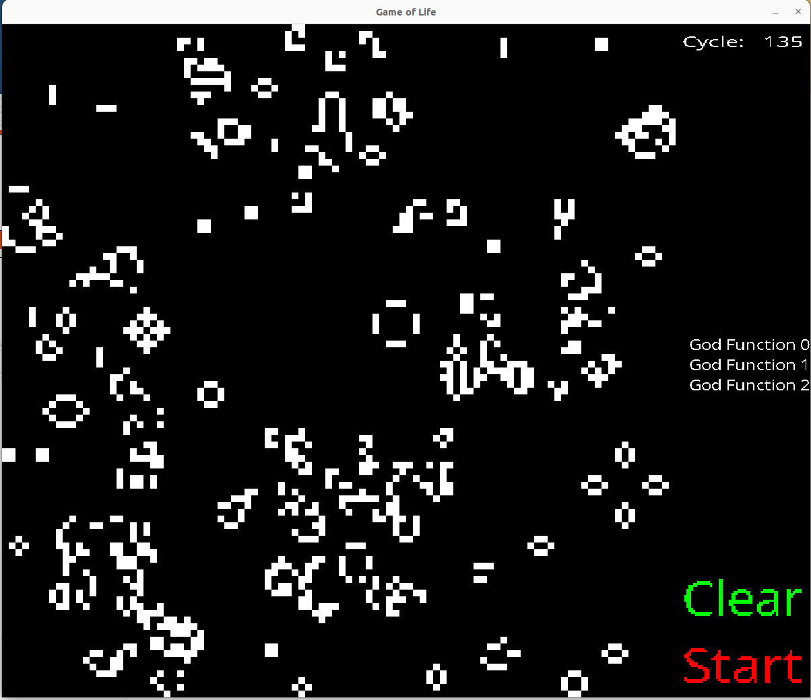

You can plug in more god functions in `src/main.cc`, by `push_back` self-defined functions to `god_functions`.

## Sample Screenshots

1. `god_function0` seeds life at the boarder.
   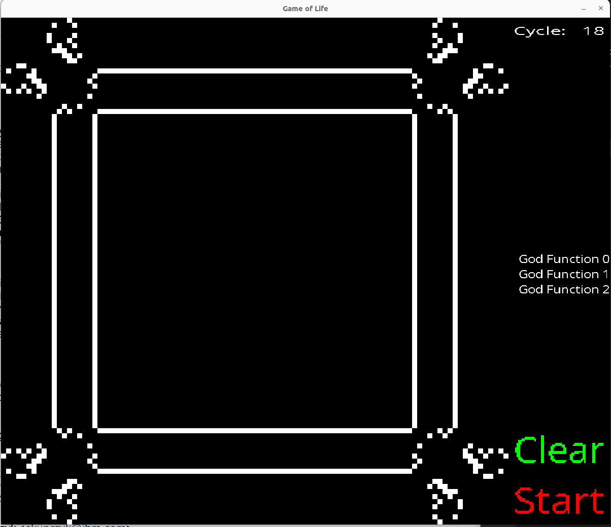
   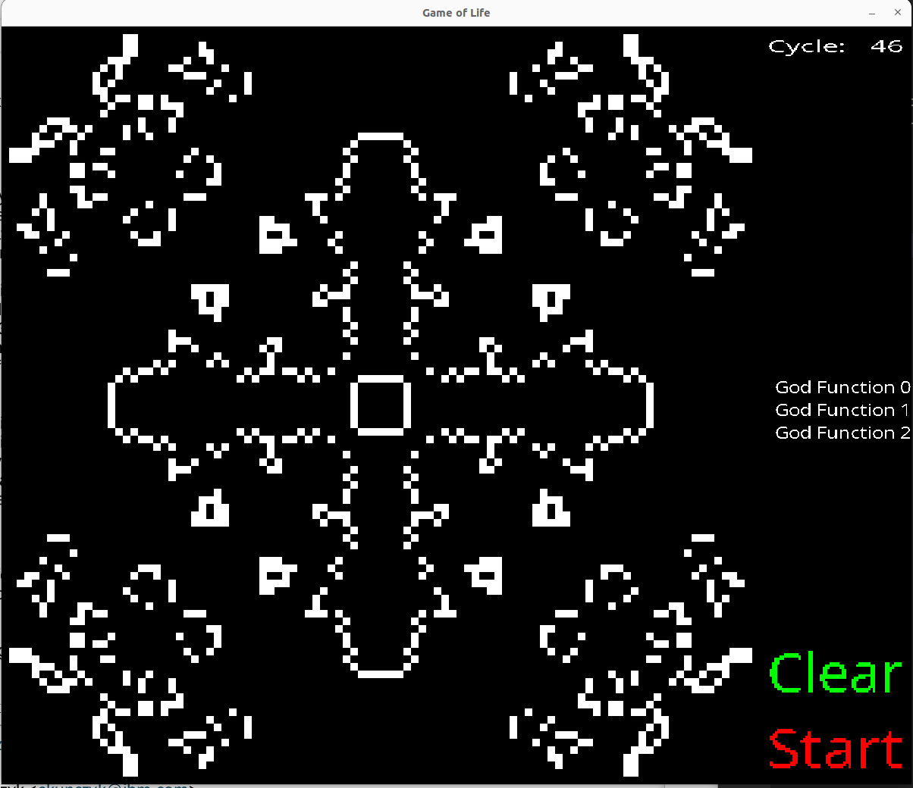
   A stable state after many rounds:
   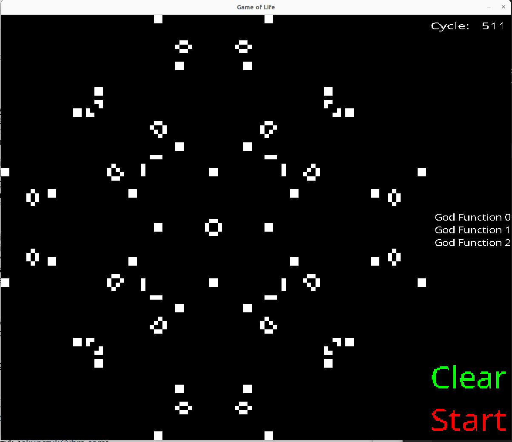
2. `god_function1` seeds life in a normal distribution, i.e. the center of the board is more likely to be alive than the edges.
   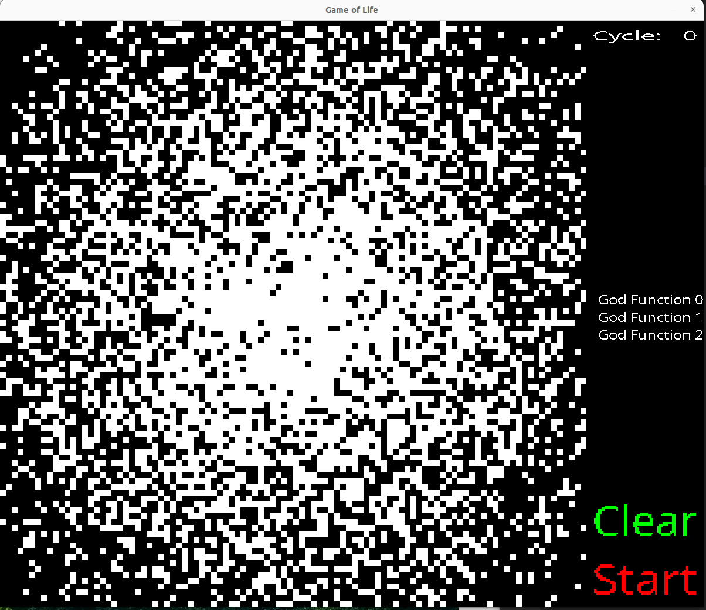
   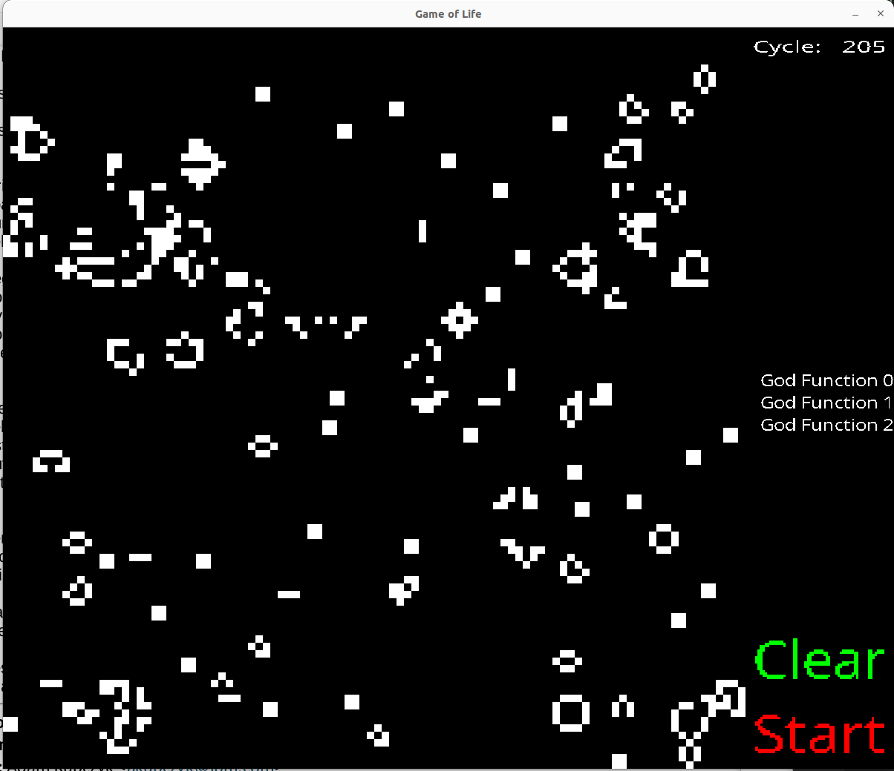
3. `god_function2` terminates life in an anti-normal distribution, i.e. the edge of the board is more likely to be dead than the center. I initialized the game by `god_function0`, ran for some cycles, and applied `god_function2`:
   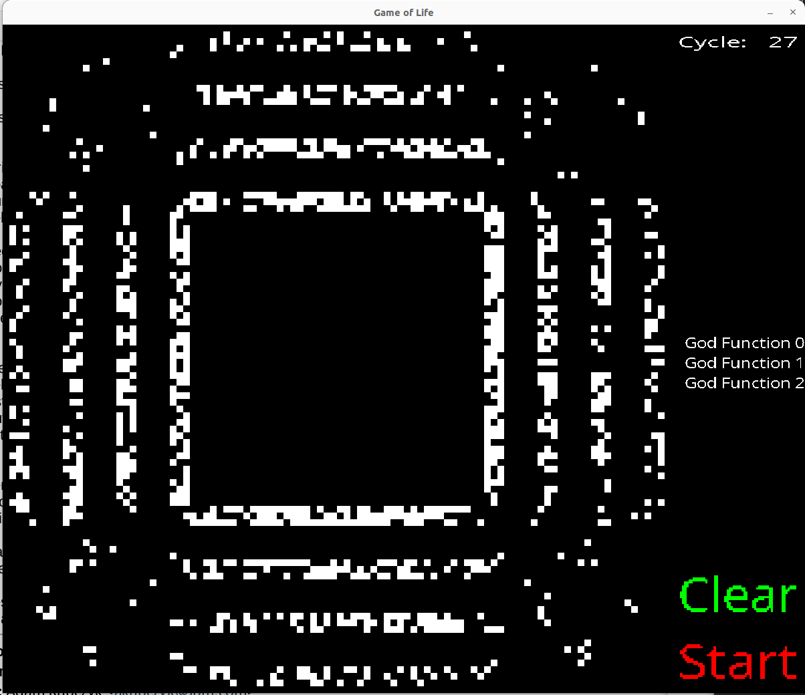
   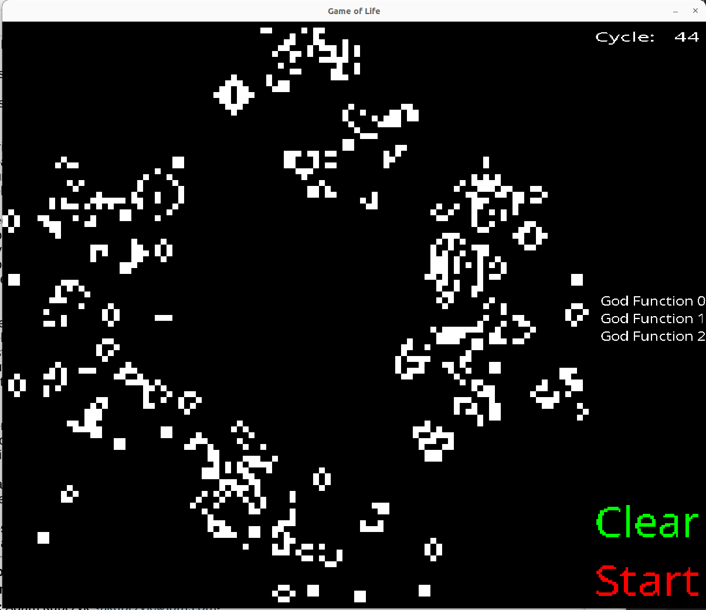
   I waited for many cycles, but it seems that it did not end in a "stable" state.
   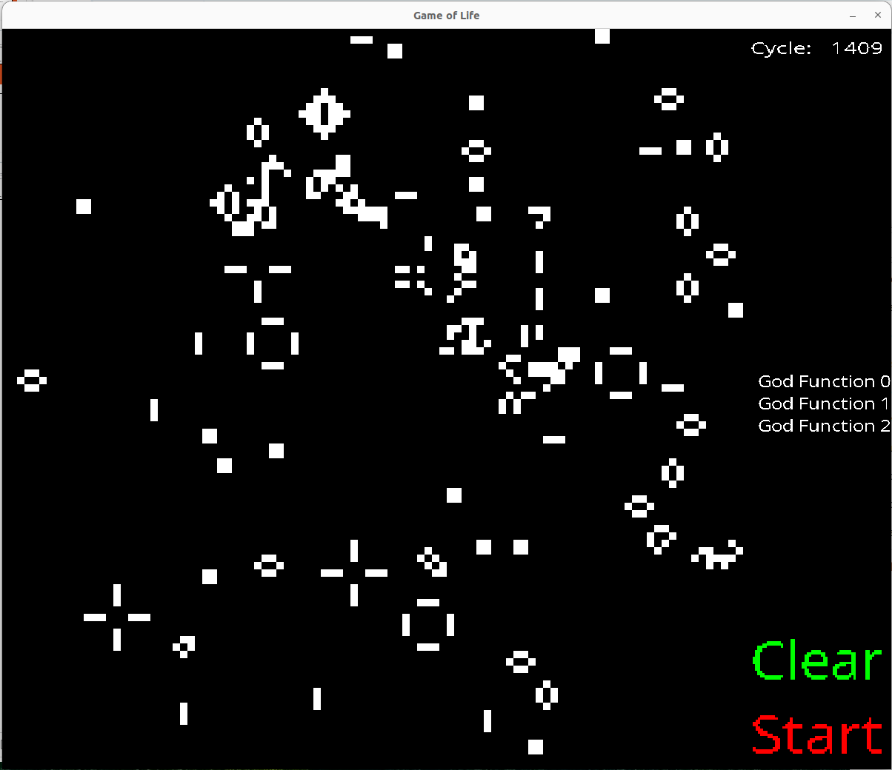
   